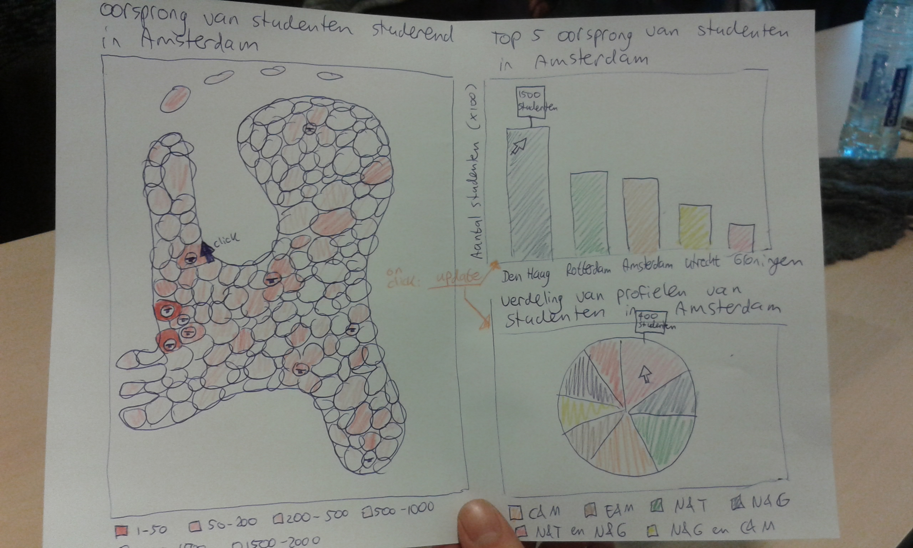

###Uit welke gemeentes komen eerstejaarsstudenten die naar het hoger onderwijs gaan?
###Voorstel programmeertheorie

####Lysanne van Beek
####10544259

Het probleem dat opgelost wordt voor de gebruiker is dat het inzichtelijk gemaakt wordt
per stad met een (of meerdere) instelling(en)voor hoger onderwijs waar hun eerstejaarsstudenten
vandaan komen. Blijven de meeste studenten in de buurt van de plek waar ze hun examen hebben gedaan?
Zijn er verschillen tussen steden in het aantal studenten met bepaalde profielen?
Deze visualisatie zal dit hopelijk verhelderen.

De features om dit mogelijk te maken zijn:
- Een kaart van Nederland met een bolletje bij elke stad waar een universiteit (MVP) en/of hbo (optional) is.
- Als er op een bolletje geklikt (interactie 1) wordt verschijnen er:
	- op de kaart een heat map waarbij per gemeente de kleur aangeeft hoeveel studenten uit die gemeente
	in de aangeklikte stad zijn gaan studeren(MVP);
	- een bar chart met de 5 gemeentes waar de meeste studenten vandaan komen die in die stad zijn gaan studeren (MVP) ;
	- een pie chart met de verdeling van profielen van de studenten uit die stad (MVP).
- Met behulp van een drop down menu kunnen er verschillende jaren geselecteerd worden (interactie 2)(MVP);
- Met behulp van een ander drop down menu kan er gekozen worden om alleen HBO, WO of beide
niveaus te laten zien (optional).
- Bij het openen van de pagina zijn de default settings de kaart met bolletjes op elke studentenstad (maar zonder
stromen), een bar graph met de 5 gemeentes waar in totaal de meeste studenten vandaan komen, en in de pie chart
de verdeling van profielen van alle studenten. Dit is van het meest recente jaar.

Voor deze visualisatie zal een dataset van DUO gebruikt worden waarin o.a. de gemeentes waar
eerstejaarsstudenten eindexamen hebben gedaan, hun profielen en de BIN nummers van de onderwijsinstellingen waar
ze zijn gaan studeren zijn opgenomen: https://duo.nl/open_onderwijsdata/databestanden/stroom/doorstroom-3.jsp 
Om de BIN nummers naar gemeentes om te zetten zal nog gezocht moeten worden naar een bestand dat
de BIN nummers en corresponderende onderwijsinstellingen en gemeentes bevat.

legenda pie chart:
http://bl.ocks.org/wayneminton/a12b563819b04a3555aa
slider:
http://thematicmapping.org/playground/d3/d3.slider/
https://github.com/MasterMaps/d3-slider/blob/master/index.html
Tooltips
http://labratrevenge.com/d3-tip/javascripts/d3.tip.v0.6.3.js
