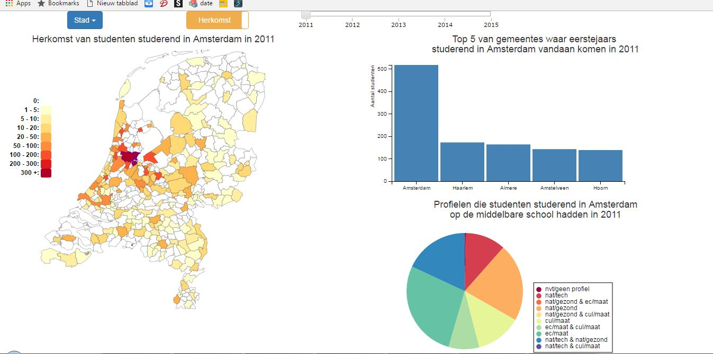

##Report Programmeerproject
##Lysanne van Beek, 10544259

###Beschrijving
De visualisatie heeft als doel de herkomst en bestemming van eerstejaarsstudenten
in het WO per gemeente te visualiseren, en welke profielen deze studenten
hadden op de middelbare school. Er wordt een kaartje van Nederland getoond opgedeeld 
in gemeentes, die ingekleurd worden op basis van hoeveel studenten er uit een
gemeente komen of hoeveel er gaan studeren. Ook is er een bar graph die de top vijf
van gemeentes waar de meeste studenten zijn gaan studeren of vandaan komen te zien.
Tenslotte wordt met behulp van een pie chart de verdeling van profielen getoond.
Dit alles is te zien voor de jaren 2011-2015. Hiermee is het makkelijk om inzicht
te verkrijgen in de spreiding van studenten, waar leerlingen gaan studeren, en 
welke profielen in welke steden vaker voorkomen.

###Technisch ontwerp
De code bevat de volgende elementen: globals, algemene
functies,  functies om de bar graph en pie chart te initialiseren en up te daten
(initPiePlot en initBarplot), verschillende elementen die de dataset kunnen updaten, 
namelijk een dropdown menu; een toggle; een 'click-map' en een slider; een functie
om data in het juiste format te zetten (loadData), een functie om de juiste dataset 
te selecteren en in te laden (selectDataset) en een functie om de datamap te maken
(makeMap). 

De bovenstaande componenten zijn sterk met elkaar verweven. Als de pagina voor het eerst
geladen wordt, wordt de data van 2011 ingeladen, is de geselecteerde stad Amsterdam,
en wordt de herkomst getoond van studenten die hier studeren getoond. Dit gebeurt door eerst
met de functie loadData de data in het juiste formaat te zetten om het in te laden in de datamap.
Vervolgens worden de functies makeMap, updatePiePlot en updateBarplot aangeroepen om de map,
pie plot en bar graph te maken en updaten.

Als de slider gebruikt wordt, wordt de functie selectDataset aangeroepen, die afhankelijk van 
de instelling van de toggle de juiste dataset selecteert en opslaat in str. Vervolgens wordt 
in dezelfde functie de geselecteerde data ingeladen en de map, pie plot en bar graph geüpdatetet.

Bij het klikken op een stad van het dropdown menu wordt de omlijning van de eerder geselecteerde
gemeente weer 'normaal' gemaakt, waarna de nieuw geklikte gemeente opgeslagen wordt, de functie
selectDataset aangroepen wordt (zoals boven) en de gemeente een dikke, paarse omlijning krijgt. 

Bij het verschuiven van de toggle kan als 'Herkomst' selecteerd is het dropwdown menu gewoon 
selecteerd worden. De standaard gemeente die hier geselecteerd is, is Amsterdam. Dit omdat als
van 'Bestemming' teruggeschakelt kan worden naar 'Herkomst' en als er dan een gemeente geselecteerd
is zonder universiteit (zoals bijvoorbeeld Den Haag) ontstaan er errors. Als bij de toggle echter 
'Bestemming' is geselecteerd kan er niet op het dropdown menu geklikt worden (maar moet er op de 
kaart geklikt worden). In beide gevallen wordt vervolgens de functie selectDataset aangeroepen. 

Nadat de map gemaakt is (done), kan als 'Bestemming' geselecteerd is op de kaart geklikt worden
om een gemeente te selecteren. Ook hier worden weer de randen van de gemeentes aangepast en 
de functie selectDataset aangroepen. 

###Uitdagingen en veranderingen
Er zijn een aantal elementen die in de uiteindelijke visualisatie anders zijn dan
ik vooraf bedacht had. Ten eerste was ik van plan bogen te trekken tussen gemeentes,
waarbij de dikte van de boog aan zou geven hoeveel studenten uit de ene naar de
andere gemeente zijn gegaan. In de eerste week besefte ik echter al dat dit voor
een heel onoverzichtelijk kaartje zou zorgen, aangezien in bijvoorbeeld Amsterdam
studenten uit ongeveer 180 verschillende gemeentes komen. Om deze reden heb ik uiteindelijk
gekozen voor een heat map, aangezien deze hetzelfde weergeeft, maar op een overzichtelijkere
manier.

Ten tweede was het originele plan om gemeentes met een universiteit een ander kleurtje te
geven of een icoontje overheen te plaatsen waarna de gebruiker er op kon klikken om de
visualisatie voor die gemeente te zien. Beide opties waren echter niet praktisch. De 
gemeente een andere kleur geven zou niet werken aangezien er gebruik wordt gemaakt van
een heat map, waarbij elke kleur een betekenis heeft en dus een gemeente niet zomaar
een andere kleur kan krijgen. Ook een icoontje op de gemeente plaatsen bleek vrij 
onmogelijk, aangezien sommige gemeentes (zoals Delft en Leiden) zo klein zijn dat ze
dan helemaal niet meer te zien zouden zijn. Om deze redenen is gekozen om een dropdown
menu te maken met alle gemeentes met een universiteit er in, in plaats van te klikken
op de kaart. Een zoekfunctie was ook nog mogelijk geweest, maar het leek mij praktischer
om een dropdown te gebruiken aangezien er slecht 11 gemeentes met een universiteit zijn,
en gebruikers nu niet zelf hoeven te bedenken welke dat ook al weer zijn. Om de bestemming
van studenten te bekijken is wel gekozen om te klikken op de kaart. Dit omdat er zoveel
gemeentes zijn dat ze niet meer in een dropdown passen.

Tenslotte was ik in eerste intstantie niet van plan om ook per gemeente te laten zien
waar studenten zijn gaan studeren, maar tijdens de presentaties en groepsbesprekingen
bleek dat veel mensen het leuk zouden vinden als dat ook gevisualiseerd zou worden. Het
visualiseren van de HBO instellinge heb ik uiteindelijk achterwege gelaten, aangezien
dat er te veel zijn om de visualisatie mooi en overzichtelijk te houden.

###Beslissingen
Ik wilde graag zowel een kaartje als een bar graph maken van de aantallen studenten per
gemeente. Dit lijkt hetzelfde doel te dienen, maar dat is niet zo. De bar graph laat in
één oogopslag de vijf gemeentes zien waar de meeste studenten naartoe gaan of vandaan
komen. Je dankzij de hoogte van de balken makkelijk zien om hoeveel studenten het gaat, 
en welke gemeentes populairder zijn dan anderen. De kaart laat echter voornamelijk de
spreiding van studenten zien: hoe verspreiden studenten zich over het land als ze gaan
studeren? Zo zie je goed dat de meeste mensen die in Groningen gaan studeren uit het 
noorden en midden van het land komen, terwijl dit voor Utrecht veel meer gespreid is.

Achteraf had ik als er meer tijd was geweest nog graag een zoekbalk gemaakt voor het
kiezen van de gemeentes waarvoor je wil zien waar leerlingen zijn gaan studeren. Nu
moet er op de kaart geklikt worden, terwijl je niet altijd weet waar een gemeente precies
ligt. Ook was een kaartje maken met de bestemmingsgemeentes misschien niet de beste optie:
er zijn immers maar 11 gemeentes waar een universiteit is, dus het overgrote gedeel van
de kaart is niet ingekleurd. Voor nu was het echter de beste oplossing aangezien de indeling
van de pagina op deze manier hetzelfde blijft en het makkelijk te vergelijken is.  

